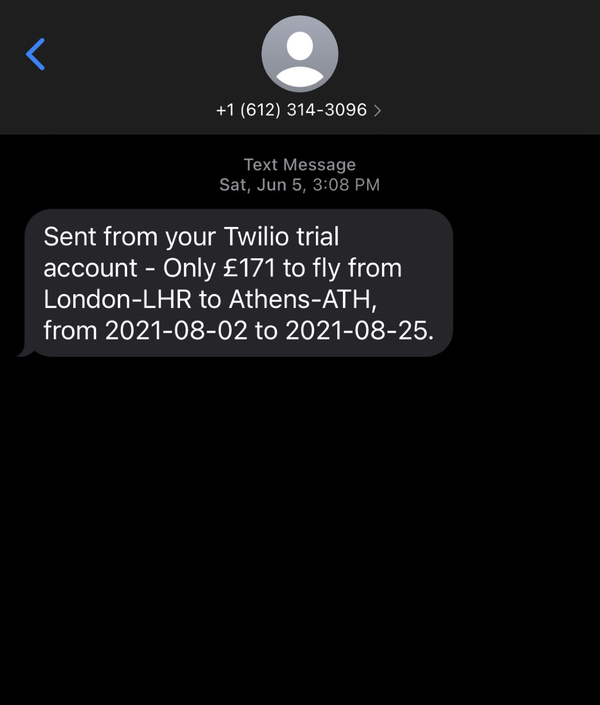

# flight-deals
Flight deals app was created using a combination of difference APIs. Using your nearest airport's IATA code,
we are able to find cheap flights to any airport of your choice. We can compare flight prices to the historical
low prices and if we come across a deal that is lower than the historical price, then we alert the customer
by sending a message to their phone.

1) Twilio was used to send alerts to the client phones.
2) Flight data was retrieved using Tequila API

Here is an example of an alert a client would receive when the app discovers a great flight deal:

